# AgentOps Kit

A reference kit for building **production-grade Agentic AI on Amazon Bedrock AgentCore**, with a complete AgentOps loop you can keep improving and operating over time.

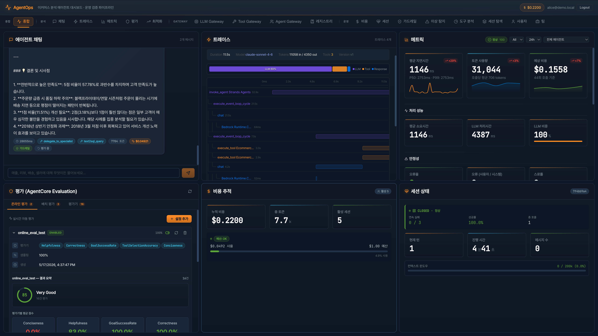

## Why this kit

Shipping an agent demo is easy. Running it in production — and **making it better every week** — is the hard part. This kit treats agents as long-lived systems that need the same operational rigor as any other service:

- **Govern** what models, tools, and sub-agents the agent is allowed to use (three Gateways).
- **Observe** every step (traces, tokens, cost, guardrail hits) in CloudWatch GenAI Observability + Langfuse.
- **Evaluate** quality continuously with sampled production traffic, on-demand checks, and batch suites.
- **Optimize** prompts and configuration with AgentCore Recommendations → Configuration Bundles → A/B Gateway Rules.
- **Apply** the winner back to the runtime — closing the loop.

The included e-commerce analytics use case (Olist dataset on Aurora Serverless v2) is just a vehicle: every component — Gateways, guardrails, evaluators, optimization, dashboard — is reusable for your own agent.

```mermaid
flowchart LR
    Build["1 · Build<br/>Strands · MCP<br/>AgentCore Runtime"]
    Govern["2 · Govern<br/>LLM · Tool · Agent<br/>Gateways"]
    Observe["3 · Observe<br/>OTel · CloudWatch<br/>Langfuse"]
    Evaluate["4 · Evaluate<br/>Online · On-demand<br/>Batch"]
    Optimize["5 · Optimize<br/>Recommendations<br/>Bundles · A/B"]
    Apply["6 · Apply<br/>PROMPT_VERSION<br/>promotion"]

    Build --> Govern --> Observe --> Evaluate --> Optimize --> Apply
    Apply -. continuous loop .-> Observe

    classDef build  fill:#e8f1ff,stroke:#1f6feb,color:#0b3a85,stroke-width:1.5px
    classDef govern fill:#ede7ff,stroke:#7d4dff,color:#3b1f8a,stroke-width:1.5px
    classDef tele   fill:#e6f7ff,stroke:#0969da,color:#0a3a72,stroke-width:1.5px
    classDef eval   fill:#e8f7ee,stroke:#2da44e,color:#0b5d2c,stroke-width:1.5px
    classDef opt    fill:#fff4d6,stroke:#b8860b,color:#5b3b00,stroke-width:1.5px
    classDef apply  fill:#ffeaea,stroke:#cf222e,color:#7a1018,stroke-width:1.5px

    class Build build
    class Govern govern
    class Observe tele
    class Evaluate eval
    class Optimize opt
    class Apply apply
```

---

## Features

### Multi-Agent Orchestration (A2A)
- Three independent **AgentCore Runtimes** (main + reviews specialist + logistics specialist).
- Role-based tool filtering forces the main agent to **delegate domain questions** to specialists via `delegate_to_specialist`, exercising the Agent Gateway path on every domain query.
- Streaming responses (SSE) with per-event `text_delta` / `tool_use` / `final` payloads.

### Three Gateways
- **LLM Gateway** (`GatewayBedrockModel`) — model routing (`quality` / `cost` / `balanced`), PII guardrails (email · credit card · CPF · AWS keys), per-model token / latency / USD metrics, OTel `gen_ai.*` spans.
- **Tool Gateway** (AgentCore Gateway → Lambda) — MCP-over-OAuth (Cognito client credentials), 6 tools (`query_sales_data`, `analyze_reviews`, `check_delivery_performance`, `get_seller_metrics`, `text2sql_query`, `delegate_to_specialist`), semantic tool search.
- **Agent Gateway** (A2A) — main agent invokes specialists through `bedrock-agentcore.invoke_agent_runtime`, surfaced as a single MCP tool.

### Production Guardrails
- **Output validation** — PII redaction, numeric grounding checks, hallucination heuristics.
- **Cost tracking** — per-session and global token / USD accumulation, configurable per-user / per-team budgets with hard enforcement.
- **Circuit breaker + session store** — automatic open / half-open / closed transitions on failure bursts.
- **Error classification + retry policy** — typed error taxonomy with backoff hints.
- **Text2SQL safety** — SELECT/WITH only, blocked DDL/DML, system-catalog blocklist, comment stripping, single-statement enforcement, automatic `LIMIT` injection.

### Full Observability
- **CloudWatch GenAI Observability** via ADOT auto-instrumentation (`opentelemetry-instrument`).
- **Langfuse** for LLM-native traces (prompts, completions, scores).
- **CloudWatch Anomaly Detection** alarms on key metrics.
- **gen_ai.* OTel metrics** + custom `llm_gateway.*` span attributes (routing tag, reason, policy, cost).
- **Live trace stream** to the dashboard via `/traces/stream` SSE.

### Evaluation Pipeline
- **AgentCore Evaluations** — Online sampling configs, on-demand single-trace eval, batch eval.
- **Builtin evaluators** — Helpfulness, Correctness, GoalSuccessRate.
- **Custom evaluator** definition included (`evaluation/custom_evaluator.json`).
- **Curated test suite** across sales / reviews / delivery / sellers categories.

### Optimization Loop
- **AgentCore Recommendations** — automatic system-prompt rewrite suggestions from recent traces + evaluator scores.
- **Configuration Bundles** — versioned prompt artifacts.
- **Gateway Rules (A/B)** — traffic splitting between bundle versions.
- **One-click apply** to runtime via `PROMPT_VERSION` env var promotion.
- Three baked-in prompt versions (`v1` baseline · `v2` structured · `v3` table + few-shot example).

### Governance & Multi-Tenancy
- **Cognito User Pool** authentication (JWT).
- **Tool Registry** — publish / approve / reject / deprecate workflow with curation tabs.
- **Users + Teams** model with per-entity usage tracking and budgets.
- **DynamoDB persistence** — chat history, sessions, cost, optimization state survive restarts.

### Operations
- **Aurora PostgreSQL Serverless v2** — private, KMS-CMK encrypted, RDS Data API only (no public networking).
- **ARM64 container** built via CodeBuild → ECR for AgentCore Runtime.
- **CloudFormation** templates for Aurora and Cognito stacks; one-shot Makefile targets for the rest.
- **React 18 + Vite + Recharts** dashboard with 18 panels mapping each pipeline stage.

---

## Screenshots

The dashboard surfaces every stage of the pipeline. Click any thumbnail to open the full-resolution image.

| | | |
|---|---|---|
| <a href="./assets/chat.png">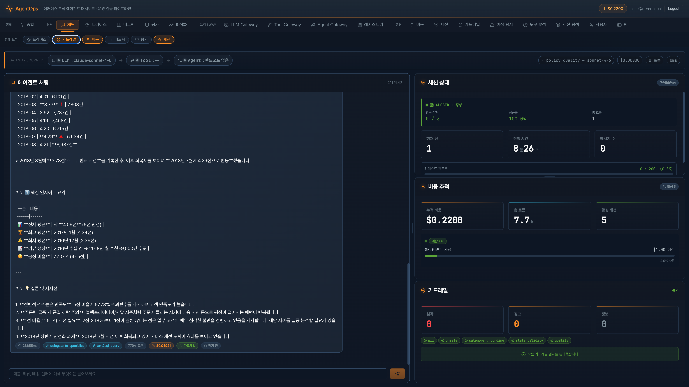</a><br/>**Chat** — streaming + A2A delegation | <a href="./assets/trace-1.png">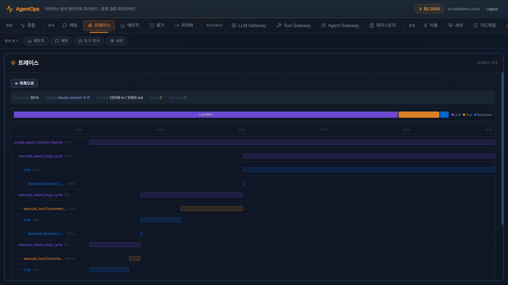</a><br/>**Traces** — OTel tree, tokens, latency | <a href="./assets/metric.png">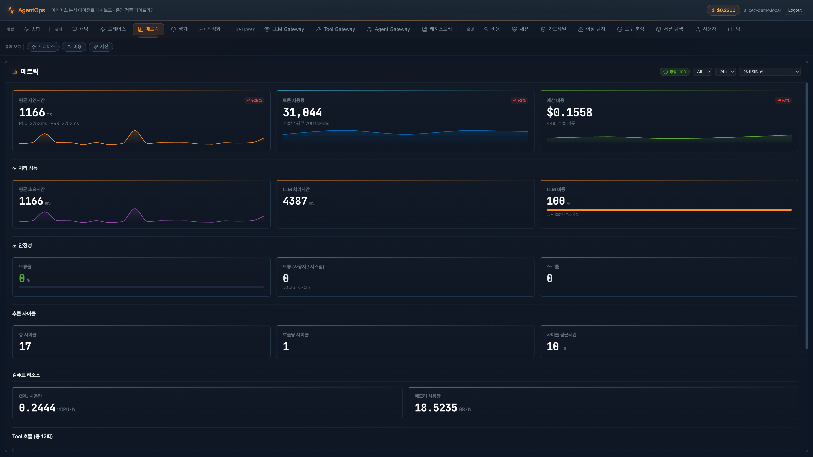</a><br/>**Metrics & session health** — circuit breaker, errors |
| <a href="./assets/llm-gateway.png">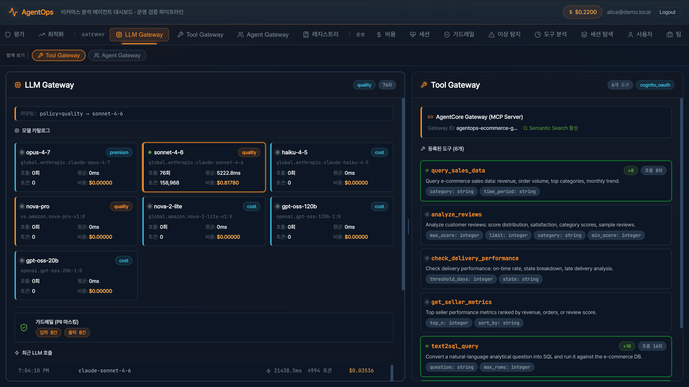</a><br/>**LLM Gateway** — routing, cost, guardrails | <a href="./assets/tool-analysis.png">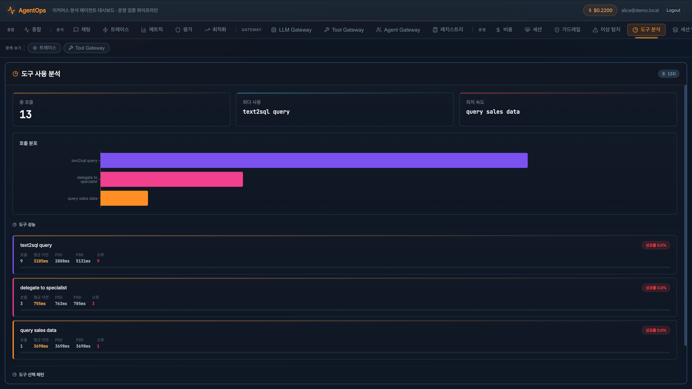</a><br/>**Tool analytics** — per-tool latency, failure rate | <a href="./assets/cost.png">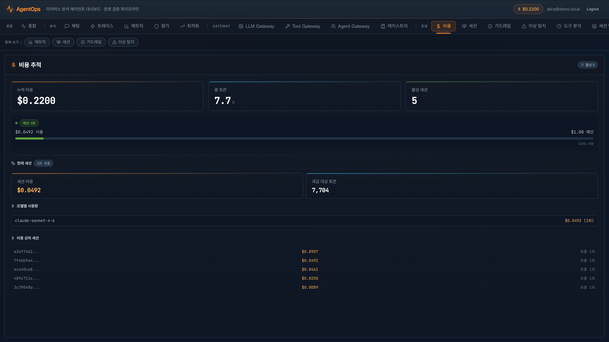</a><br/>**Cost** — per-session + global, budgets |
| <a href="./assets/eval-online.png">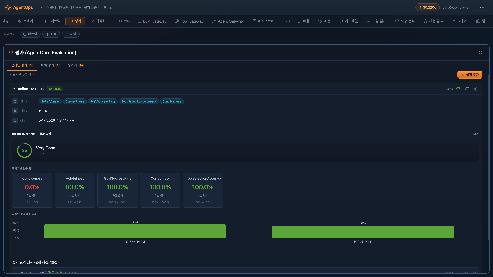</a><br/>**Online eval** — sampling config, live scores | <a href="./assets/eval-batch.png">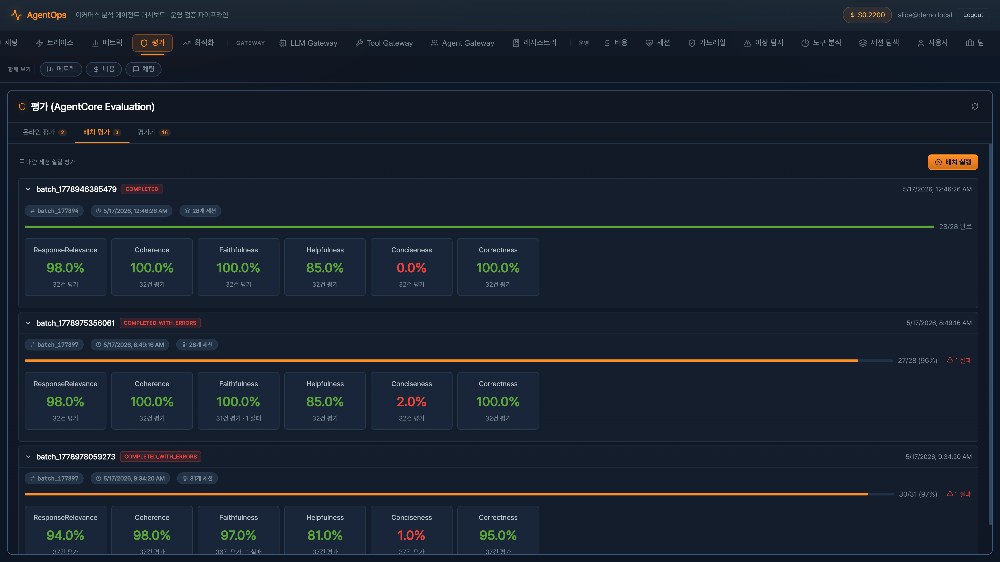</a><br/>**Batch eval** — full test-suite results | <a href="./assets/opti.png">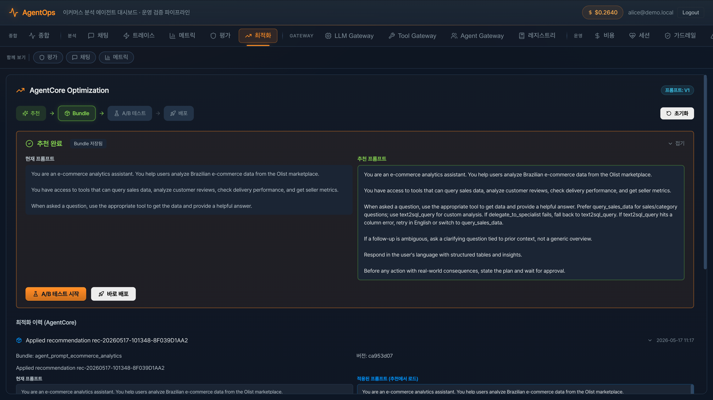</a><br/>**Optimization** — recommend → bundle → A/B → apply |
| <a href="./assets/agent-registry.png">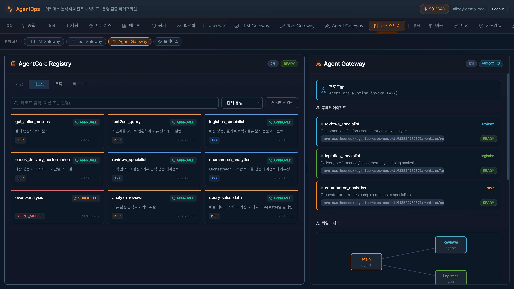</a><br/>**Agent & Tool Registry** — publish / approve / deprecate | <a href="./assets/team-1.png">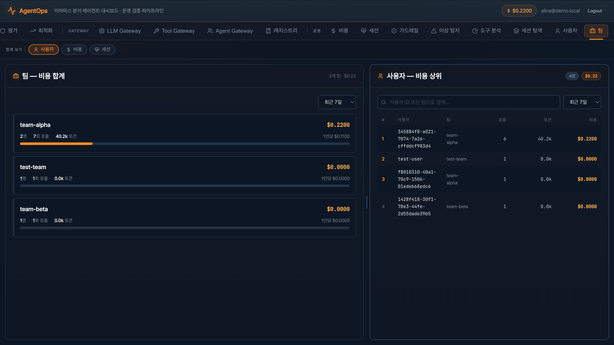</a><br/>**Teams** — usage tracking, budgets | <a href="./assets/trace-2.png">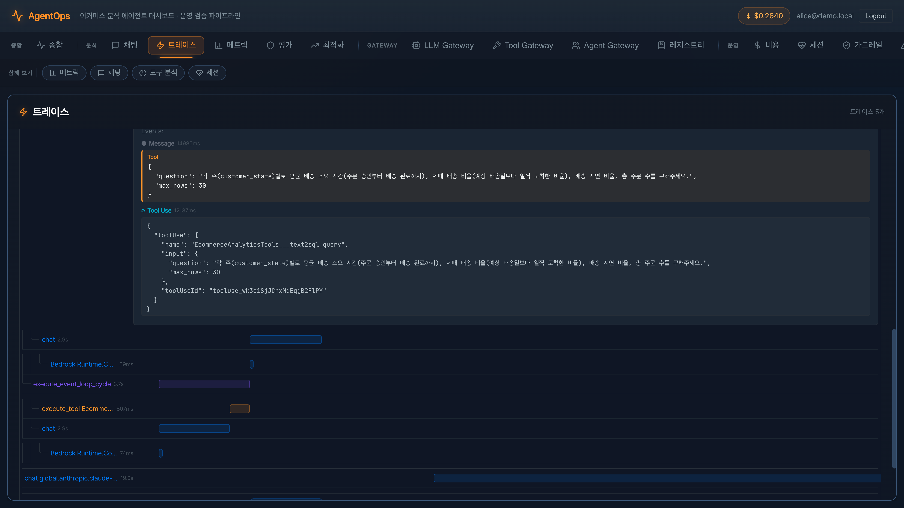</a><br/>**Trace detail** — span attributes, gen_ai.* fields |

---

## Architecture

### AWS Services

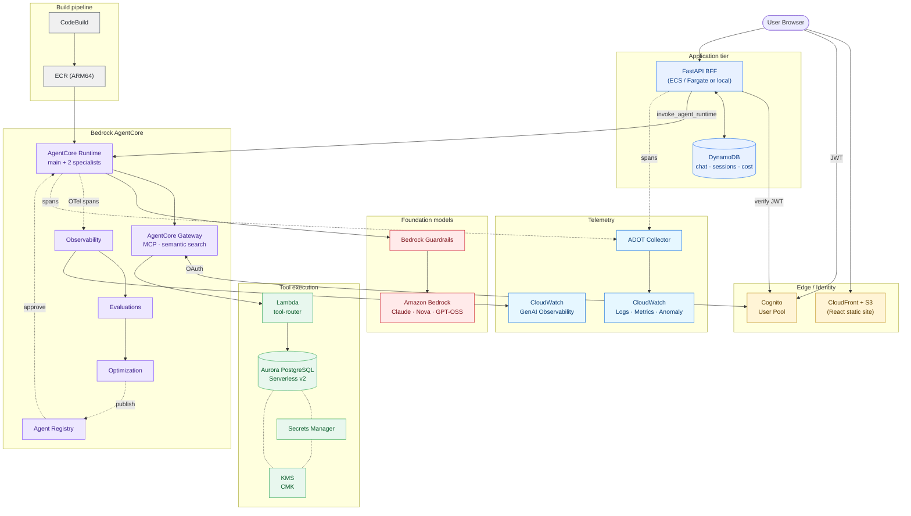

### Data Plane — request path

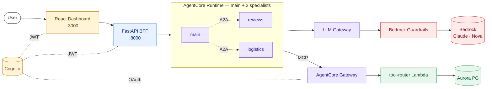

### AgentOps Plane — observe → evaluate → optimize → apply

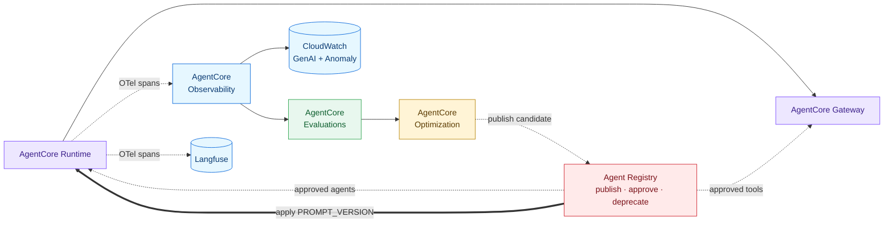

---

## Tech Stack

| Layer | Stack |
|---|---|
| **Agents** | Strands Agents · MCP client · `bedrock-agentcore` SDK |
| **Models** | Amazon Bedrock — Claude Sonnet 4.6 (default), Opus 4.7, Haiku 4.5, Nova-Pro, Nova-2-Lite, GPT-OSS |
| **Runtime** | AgentCore Runtime (containerized, ARM64), CodeBuild → ECR pipeline |
| **Tool Gateway** | AgentCore Gateway (MCP) → Lambda router → Aurora Data API |
| **Agent Gateway** | A2A — main agent delegates to `reviews_specialist` / `logistics_specialist` |
| **LLM Gateway** | Custom `GatewayBedrockModel` — routing (cost/quality/balanced), PII scrub, per-model cost/latency metrics |
| **Auth** | Amazon Cognito (User Pool + JWT) |
| **Data** | Aurora PostgreSQL Serverless v2 · Olist Brazilian E-commerce dataset |
| **API** | FastAPI · Pydantic · DynamoDB (chat / sessions / cost / opt. state) |
| **Frontend** | React 18 · Vite · TypeScript · Recharts · AWS Amplify |
| **Observability** | OpenTelemetry (ADOT) → CloudWatch GenAI Observability · Langfuse · CloudWatch Anomaly Detection |
| **Evaluation** | AgentCore Evaluations — Builtin (Helpfulness / Correctness / GoalSuccessRate) + custom evaluators |
| **Optimization** | AgentCore Recommendations · Configuration Bundles · Gateway Rules (A/B testing) |

---

## Quick Start

```bash
# 1. Install dependencies
make install
# → pip install -r requirements.txt + (cd frontend && npm install)

# 2. Place Olist CSVs under _data/
#    https://www.kaggle.com/datasets/olistbr/brazilian-ecommerce

# 3. Provision infra
bash infra/deploy.sh cognito       # Cognito user pool
bash infra/deploy.sh deploy        # Aurora Serverless v2 + Secrets + KMS
bash infra/deploy.sh env           # print .env → save at project root

# 4. Load data (via Aurora Data API)
make data-migrate

# 5. Create AgentCore Gateway + register Lambda target
make gateway-setup

# 6. Deploy AgentCore Runtimes (main + 2 specialists)
make agent-deploy                  # bash infra/deploy-agent.sh

# 7. (Optional) CloudWatch dashboard + Anomaly Detection
make observability-setup

# 8. Start the demo
make demo-start
#   Frontend  → http://localhost:3000
#   API       → http://localhost:8000  (ADOT auto-instrumented)
```

---

## Repository Layout

```
agentops-kit/
├── agent/                          # AgentCore Runtime container entrypoint
│   ├── agent.py                    #   Strands Agent + MCP + role-based tool filter
│   ├── llm_gateway.py              #   LLM Gateway (routing / guardrails / cost)
│   └── system_prompt.py            #   v1 / v2 / v3 prompt versions
├── api/                            # FastAPI BFF (50+ endpoints)
│   ├── server.py                   #   chat / traces / evals / optimization / users …
│   ├── agentcore_runtime.py        #   invoke_agent_runtime (SSE)
│   ├── agentcore_evaluation.py     #   Online / on-demand / batch eval
│   ├── agentcore_optimization.py   #   Recommendations / Bundles / A-B
│   ├── guardrails.py               #   PII redaction · grounding · hallucination
│   ├── cost_tracker.py             #   tokens · cost · budget (per-session / global)
│   ├── session.py                  #   session state + circuit breaker
│   ├── persistence.py              #   DynamoDB persistence
│   ├── cloudwatch.py               #   GenAI Observability helpers
│   ├── langfuse_tracing.py         #   Langfuse tracer
│   ├── otel_setup.py               #   ADOT bootstrap
│   ├── genai_metrics.py            #   gen_ai.* OTel metrics
│   ├── analytics.py                #   event queue + sinks (PII redaction)
│   ├── auth.py · users.py          #   Cognito JWT · users / teams / budgets
│   └── telemetry.py                #   span → SSE broadcaster
├── frontend/                       # React dashboard (one panel per stage)
│   └── src/components/             #   Chat / Trace / Metrics / Eval / Cost
│                                   #   LLMGateway / ToolGateway / AgentGateway
│                                   #   Optimization / Users / Teams / Registry
│                                   #   Anomaly / Guardrails / SessionHealth …
├── infra/                          # CloudFormation + deployment scripts
│   ├── aurora.yaml                 #   Aurora Serverless v2 + KMS CMK
│   ├── cognito.yaml                #   user pool + app client
│   ├── lambda/handler.py           #   Gateway target — routes 6 tools
│   ├── setup_gateway.py            #   AgentCore Gateway + tool schemas
│   ├── setup_registry.py           #   Tool Registry seed
│   ├── dashboard.py                #   CloudWatch dashboard
│   ├── anomaly_setup.py            #   Anomaly detector + alarms
│   ├── deploy.sh · deploy-agent.sh #   infra / Runtime deployment
│   └── setup_eval_role.sh          #   Evaluation IAM role
├── data/migrate.py                 # Olist CSV → Aurora (tables + analytics views)
├── evaluation/                     # AgentCore evaluation definitions
│   ├── test_cases.json             #   sales / reviews / delivery / sellers
│   ├── custom_evaluator.json
│   └── run_eval.py
├── Dockerfile                      # ARM64 Runtime container
├── Makefile                        # demo / eval / optimization shortcuts
└── requirements.txt
```

---

## Multi-Agent Topology (A2A)

| Runtime | Allowed Tools | Role |
|---|---|---|
| **`ecommerce_analytics`** (main) | `query_sales_data`, `text2sql_query`, `delegate_to_specialist` | Handles revenue + ad-hoc SQL directly; delegates domain questions |
| **`reviews_specialist`** | `analyze_reviews` | Review scores · sentiment · category satisfaction |
| **`logistics_specialist`** | `check_delivery_performance`, `get_seller_metrics` | Delivery on-time rate · seller performance |

The main agent intentionally lacks the domain-specific tools (enforced by `_ROLE_ALLOWED_TOOLS` in `agent/agent.py`) — when a domain question arrives, the only way forward is `delegate_to_specialist`, so the Agent Gateway A2A flow is exercised on every domain query.

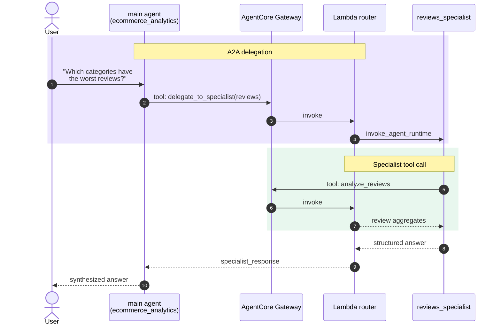

---

## LLM Gateway

`agent/llm_gateway.py`'s `GatewayBedrockModel` extends Strands `BedrockModel` to add:

- **Model routing** — the `LLM_GATEWAY_ROUTING=quality|cost|balanced` env var picks from a catalog (Sonnet / Opus / Haiku / Nova / GPT-OSS).
- **Input/output guardrails** — masks email, credit-card, Brazilian CPF, and AWS access keys.
- **Per-model + per-tag metrics** — call count · tokens · latency · USD cost · routing reason (CloudWatch GenAI traces + in-memory snapshot).
- **OTel span attributes** — `gen_ai.system / model / usage.*` plus `llm_gateway.routing_*` for filtering in the trace explorer.

---

## Operating Loop

Treat this as the weekly cadence you would run against a production agent:

```bash
# 1. Send traffic through the agent
make agent-invoke
#   agentcore invoke '{"prompt":"What was total revenue in 2017?","prompt_version":"v1"}'

# 2. Score current quality (baseline)
make demo-eval                 # python evaluation/run_eval.py --limit 5

# 3. Ask AgentCore for a prompt improvement based on recent traces
make demo-recommend            # POST /optimization/recommendations

# 4. Wrap the candidate as a Configuration Bundle and split traffic via Gateway Rules
#    (use the Optimization tab in the dashboard, or:)
make demo-ab-status            # GET /optimization/ab-tests

# 5. Re-evaluate the winner side-by-side with the baseline
make demo-compare              # python evaluation/run_eval.py --compare --limit 5

# 6. Promote the winner — PROMPT_VERSION is updated and traffic flips
#    POST /optimization/apply

# Reset the pipeline (clear bundles / rules / eval state)
make demo-reset
```

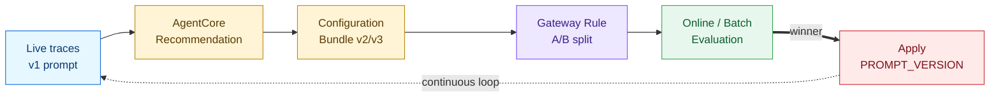

### Key API Endpoints (FastAPI BFF)

| Group | Routes |
|---|---|
| Chat | `POST /chat`, `POST /chat/stream`, `GET /chat/history` |
| Traces | `GET /traces`, `GET /traces/{id}`, `GET /traces/stream` |
| Evaluations | `GET/POST/PUT/DELETE /evaluations/online/config[s]`, `POST /evaluations/run\|batch` |
| Optimization | `POST /optimization/{recommendations,bundles,ab-tests,apply,deploy,reset}` |
| Gateways | `GET /gateways/{llm,tool,agent,journey}` |
| Governance | `GET/POST/PUT /registry/...`, `GET/POST /users\|teams\|budgets` |
| Observability | `GET /observability/{agent-timeline,tool-analytics,anomalies}`, `GET /metrics`, `GET /analytics/...` |
| Guardrails / Cost / Session | `POST /guardrails/test`, `GET /cost`, `GET /session/{id}`, `POST /circuit/{id}/reset` |
| System Prompt | `GET/PUT /system-prompt`, `GET /system-prompt/versions` |

---

## Dashboard Panels

`frontend/src/components/` — each tab maps to one stage of the pipeline:

- **Chat** — SSE streaming + tool-call visualization
- **Traces** — OTel trace tree, tokens / latency / cost
- **Metrics / SessionHealth** — call trends, circuit breaker, error taxonomy
- **Guardrails** — PII / grounding / hallucination check results
- **LLM Gateway** — per-model usage, cost, routing reason, guardrail stats
- **Tool Gateway** — Lambda tool call distribution, latency, failure rate
- **Agent Gateway** — main ↔ specialist delegation flow (A2A)
- **Cost** — session + global token / USD accumulation, budget enforcement
- **Eval** — Online configs, on-demand, batch results
- **Optimization** — Recommendation → Bundle → A/B → Apply full loop
- **Registry** — tool governance (publish / approve / deprecate)
- **Users / Teams** — multi-tenant usage and budgets
- **Anomaly** — CloudWatch anomaly detection results
- **SessionExplorer / AgentTimeline / ToolAnalytics** — session and execution analysis

---

## System Prompt Versioning

`agent/system_prompt.py` exposes three reference versions — v1 (baseline) · v2 (structured) · v3 (table + few-shot example) — so you can replay an end-to-end improvement cycle without writing prompts by hand:

1. Evaluate with v1 → observe a low GoalSuccessRate.
2. AgentCore Recommendation produces a v2/v3 candidate from real traces; register it as a Configuration Bundle.
3. Compare via Gateway Rule traffic splitting (A/B).
4. Promote the winner to the runtime via the `PROMPT_VERSION` env var (`POST /optimization/apply`).

In production you would replace the canned versions with your own, and let the Recommendation API generate new candidates on a schedule.

---

## Configuration

The runtime reads `.env` (auto-generated by `bash infra/deploy.sh env`):

```bash
# Aurora
DB_CLUSTER_ARN=...
DB_SECRET_ARN=...
DB_NAME=ecommerce

# AgentCore
AGENTCORE_REGION=us-east-1
AGENTCORE_AGENT_ID=ecommerce_analytics-...
AGENTCORE_LOG_GROUP_ARN=...
AGENTCORE_SERVICE_NAME=ecommerce_analytics
AGENT_RUNTIME_NAMES=ecommerce_analytics,reviews_specialist,logistics_specialist
GATEWAY_URL=https://...amazonaws.com/mcp

# Bedrock
BEDROCK_MODEL_ID=global.anthropic.claude-sonnet-4-6
LLM_GATEWAY_ROUTING=quality

# Cognito (Gateway OAuth + Frontend)
COGNITO_CLIENT_ID=...
COGNITO_CLIENT_SECRET=...
COGNITO_TOKEN_ENDPOINT=https://....auth.us-east-1.amazoncognito.com/oauth2/token
COGNITO_USER_POOL_ID=...
COGNITO_APP_CLIENT_ID=...

# Optional
LANGFUSE_PUBLIC_KEY=...
LANGFUSE_SECRET_KEY=...
PROMPT_VERSION=v1
```

---

## Cleanup

```bash
make demo-stop
make clean
bash infra/deploy.sh delete           # Aurora + KMS CMK
# Delete AgentCore Runtimes / Gateway from the console
```
