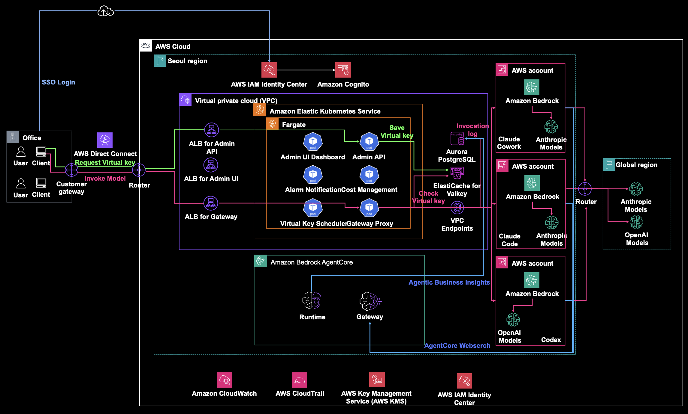

# AWSome AI Gateway

> ⚠️ **This is a sample/prototype for demonstration purposes only. Not production-ready; review and harden before any production use.**

> 사내 코딩 에이전트를 위한 통합 LLM 게이트웨이 (관리 콘솔 브랜드: **AWSome AI Gateway**)

사내 코딩 에이전트(Claude Code / Codex / Cowork) 사용자를 위한 통합 LLM 게이트웨이. OIDC 인증 기반으로 Virtual Key를 자동 발급하고, 클라이언트별로 알맞은 백엔드(AWS Bedrock native / Bedrock Mantle)로 요청을 프록시합니다. 팀/사용자/앱(client)별 예산 관리, Rate Limit, 모델 접근 제어, 사용량 추적(ROI), 서버사이드 웹서치, 그리고 자연어로 운영 데이터를 질의하는 **AI BI 어시스턴트(admin-chat-agent)**를 제공합니다.

---

## 아키텍처



인증·과금·거버넌스는 단일 게이트웨이에서 처리하되, 요청은 클라이언트(client) 종류에 따라 서로 다른 계정·백엔드로 분기합니다. 게이트웨이의 백엔드 라우팅은 코드가 아니라 `model.routing_profiles` 테이블 row로 데이터 드리븐하게 결정되며(`RoutingProfileLoader`가 Redis TTL 300s 캐시), 미등록/disabled인 client는 기본 Bedrock 경로로 폴백합니다.

> 위 다이어그램: Seoul 리전 EKS Fargate에서 게이트웨이 전 서비스가 돌고, 요청은 3개 AWS 계정의
> Bedrock으로 분기(Claude Code / Cowork / Codex). AgentCore(Runtime + WebSearch Gateway), Cognito(SSO),
> CloudWatch/CloudTrail/KMS가 함께 구성됩니다. 아래는 데이터플레인 상세(텍스트 다이어그램):

```
[Claude Code]  [Codex]  [Cowork]
   │  api-key-helper (OIDC 토큰 → VK 자동 발급; Cowork은 앱 config)
   ▼
[Admin API]  ── OIDC(Cognito) 검증 → VK 발급 (POST /v1/auth/exchange, id_token 사용)
   │
   ▼
클라이언트 ──Bearer VK──→ [Gateway Proxy] ── 인증·client 식별·예산·RateLimit·다운그레이드
                              │            → 라우팅 프로파일(routing_profiles)로 백엔드 분기
                              │
          ┌───────────────────┼───────────────────────────────┐
          ▼                    ▼                               ▼
   claude-code               codex                          cowork
   Bedrock NATIVE            Bedrock Mantle                 Bedrock Mantle
   (boto3 invoke_model)      (OpenAI Responses API)         (Anthropic Messages)
   계정 345678901234          계정 859 in-account             계정 234567890123
   (ap-northeast-2)          (us-east-2, 오하이오)           (ap-northeast-1, 도쿄)
   STS AssumeRole(374 role)  assume 없음 — pod IRSA 직접      STS AssumeRole(905 role)
   ExternalId=claude-code-…  Mantle GPT-5.5                 ExternalId=cowork-…
   실패 시 859 in-account     bearer(BedrockTokenGenerator)   Opus 4.8 (cowork-opus)
   투명 폴백(절대 안 죽음)     httpx AsyncClient               httpx AsyncClient
          │
          ▼
   [Redis] + [Aurora PostgreSQL]   ← 예산/RateLimit/비용 스트림/집계

── 서버사이드 웹서치 (아키텍처 C, routing profile web_search_enabled=True 일 때) ──
게이트웨이가 web_search 툴 주입 → 모델 tool_use 인터셉트 → AgentCore Gateway 관리형
WebSearch(MCP over httpx, SigV4/IRSA, us-east-1 전용) 호출 → 결과 재투입 → 최종 답변 스티칭.
클라이언트 무설정. (글로벌 kill-switch 기본 off)

── 운영자 BI (admin-chat-agent) ──
[Admin UI /chat] ─SSE─→ [Admin API proxy] ─SigV4─→ [Bedrock AgentCore Runtime]
                                                      │ agents-as-tools (Strands)
                                                      │  Orchestrator(Opus)
                                                      │  ├ SQL Specialist ─→ [query_db Lambda] ─→ Aurora(read-only)
                                                      │  ├ Code Specialist ─→ Code Interpreter
                                                      │  ├ SQL Validator
                                                      │  ├ Viz Specialist ─→ chart spec
                                                      │  ├ Report Specialist
                                                      │  └ L3 self-consistency(ask_sql_verified)
                                                      ▼ 실시간 스트리밍(SSE) + heartbeat
```

**멀티계정 정리**

| 항목 | 계정 | region | 백엔드 | 방언 | cross-account |
|------|------|--------|--------|------|---------------|
| 메인 배포 (게이트웨이 전 서비스 + Aurora + AgentCore Runtime/웹서치 GW + ECR) | `123456789012` | ap-northeast-2 | — | — | gateway-proxy IRSA 가 이 계정 |
| claude-code | `345678901234` | ap-northeast-2 | Bedrock NATIVE (invoke_model) | Anthropic Messages | STS AssumeRole(ExternalId=`claude-code-bedrock`), 실패 시 859 in-account 투명 폴백 |
| codex | `123456789012` (in-account) | us-east-2 | Bedrock Mantle GPT-5.5 | OpenAI Responses (`/v1/responses`) | 없음 — pod IRSA creds 직접 사용 |
| cowork | `234567890123` | ap-northeast-1 | Bedrock Mantle Opus 4.8 | Anthropic Messages | STS AssumeRole(ExternalId=`cowork-bedrock`) |

- cross-account는 `STS AssumeRole(DurationSeconds=3600)` + 선택적 `ExternalId`. claude-code(374 native)의 클라이언트는 `BedrockAccountClientProvider`가 `(role_arn, region, external_id)` 키로 vend/캐시합니다. assume 실패 시 게이트웨이는 859 in-account 클라이언트로 투명 폴백하므로 claude-code 요청은 죽지 않습니다.
- codex/cowork Mantle bearer는 `MantleCredentialBroker`가 assumed creds에서 `BedrockTokenGenerator`로 발급해 `(role, region)`으로 캐시합니다.
- provider registry는 4개 어댑터: `BEDROCK`(boto3), `OPENMODEL`(httpx vLLM), `BEDROCK_MANTLE`(cowork), `BEDROCK_MANTLE_OPENAI`(codex).

> 컴포넌트·계정·데이터플레인 전체 상세는 레포 루트 [`ARCHITECTURE.md`](ARCHITECTURE.md) 및 [`devlog_websearch.md`](devlog_websearch.md) 참조.

---

## Demo

| 데모 | 링크 |
|------|------|
| AWSome AI Gateway — 개요 및 데모 ① | [](https://youtu.be/vp-Zsb5BocI) |
| AWSome AI Gateway — 개요 및 데모 ② | [](https://youtu.be/NDDsjHrkXMQ) |

- 데모 ①: https://youtu.be/vp-Zsb5BocI
- 데모 ②: https://youtu.be/NDDsjHrkXMQ

---

## 주요 기능

- **게이트웨이 코어** — OIDC→Virtual Key 자동 발급, 3-client(claude-code/codex/cowork) × 2-방언(Anthropic Messages / OpenAI Responses) 라우팅, 클라이언트별 백엔드 분기(Bedrock native / Mantle). 팀/사용자/앱(client)별 예산(HARD_BLOCK/SOFT_WARNING/THROTTLE), Rate Limit(USER/TEAM/GLOBAL 3-scope), 팀별 모델 접근 제어(allowed_models), 자동 다운그레이드(TEAM scope), 사용량/ROI 집계(`reasoning_tokens`·`web_search_count` 서브메트릭 포함).
- **멀티앱 거버넌스 (Phase 2)** — 사용자별 모델 allow-list(팀 정책 override, migration 0014, admin-api `GET/PUT/DELETE /admin/users/{id}/allowed-models`), 사용자별 클라이언트 ACL(allowed-clients — 특정 사용자에게 claude-code/codex/cowork 중 일부만 허용), 앱(client)별 예산·Rate Limit 분리. 3-client가 각기 다른 계정·백엔드로 라우팅되는 데이터드리븐 프로파일(`routing_profiles`)이 이 거버넌스의 기반입니다.
- **service-token** — 외부 시스템(비 OIDC)용 장수명 bearer 토큰 발급/회전. admin-api `POST/GET/DELETE /admin/service-tokens` + `/rotate`. 목록은 prefix만 노출하고 원문 토큰은 발급/회전 시 1회만 반환(migration 0015).
- **Resilience** — readiness 게이트 `/health/ready`(열화/DB 풀 고갈 시 503, `/health`는 관대), 무효 VK 즉시 차단(무효키 폭주가 DB 커넥션 풀을 고갈시키지 못하도록 DB 세션을 안 엶), DB 풀 튜닝(`pool_timeout` 기본 10s fast-fail·`pool_recycle` 3600s·`pre_ping`), Redis 소켓 타임아웃/재시도 + rate-limit 회로 차단기, Redis 다운 시 in-memory rate-limit 근사 폴백, 응답 헤더 유출 방어(state에 값이 있을 때만 `X-*` 헤더 주입), 보안 이벤트 detector의 OrderedDict LRU(스푸핑된 IP churn OOM 방어), 비용 스트림 스풀링(Redis blip 시 XADD 실패 재발행).
- **서버사이드 웹서치 (아키텍처 C)** — 게이트웨이가 `web_search` 툴을 주입하고 모델의 tool_use를 가로채 AgentCore Gateway 관리형 WebSearch(MCP over httpx, SigV4/IRSA)로 검색·재투입하는 서버사이드 방식. **클라이언트(Claude Code/Codex/Cowork) 무설정** — 그냥 질문하면 검색된 답이 옵니다. anthropic/responses 두 방언 지원, AgentCore 관리형 커넥터는 us-east-1 전용, 글로벌 kill-switch(`web_search_enabled`) 기본 off. 검색 횟수·토큰·비용을 per-client 추적. 상세: [`devlog_websearch.md`](devlog_websearch.md), E2E: [`e2e_report_websearch.md`](e2e_report_websearch.md).
- **Admin UI (Next.js 14)** — 대시보드(KPI·비용 추이·모델 점유율 도넛·client 점유율 도넛·client 필터·팀/사용자 랭킹), 사용자/팀, 모델, 예산, Rate Limit, API Key, 실시간 모니터링, 분석(ROI), `/chat` BI 어시스턴트. 라이트/다크 Glass 디자인 + 기간 선택기. 대시보드 차트는 Chart.js, BI 차트는 recharts.
- **AI BI 어시스턴트 (`/chat`)** — 자연어 질문 → 검증된 SQL 자동 생성(text2SQL) → Aurora 조회 → 마크다운 표 + recharts 차트로 답변. agents-as-tools 오케스트레이터(Orchestrator + SQL/Code/Validator/Viz/Report Specialist + L3 self-consistency)를 AWS Strands + Bedrock AgentCore Runtime으로 호스팅. deep 모드 및 L4 cross-family critic(옵션)도 존재. 실시간 토큰 스트리밍 + heartbeat.

---

## 부하 / 스케일링

고동시성 SSE 스트리밍에서의 병목과 완화책을 근거와 함께 정리합니다. 과장 없이, 미검증 항목은 미검증으로 표기합니다.

- **병목(claude-code, Bedrock native 한정)** — claude-code 경로는 boto3 동기 스트림을 async 이벤트루프에서 소비하려고 매 청크마다 `run_in_executor`로 스레드풀에 offload합니다. 청크 수신이 blocking이라 활성 SSE 하나가 스트림 수명 내내 스레드 슬롯 하나를 점유합니다. 대략적 동시성 산수(HPA 최대 30 pod × uvicorn `--workers 4` = 120 프로세스, 프로세스당 기본 스레드풀 ~6 → ~720 slot)로는 수천 동시 SSE에서 슬롯이 부족해질 수 있습니다. 스레드가 네트워크 대기 중이라 CPU가 한가해 CPU 기준 HPA(targetCPU 65%)가 스케일아웃하지 않는 사각지대가 있습니다.
- **codex/cowork(Mantle)은 이 병목에서 자유** — Mantle 경로는 `httpx.AsyncClient` + `aiter_lines()`로 이미 완전 async라 스레드풀을 쓰지 않고 이벤트루프만으로 다수 스트림을 처리합니다.
- **완화책(효과 큰 순)** — (1) 스트리밍 전용 ThreadPoolExecutor: `BEDROCK_STREAM_EXECUTOR_WORKERS` env가 `>0`이면 전용 executor, `0`/미설정이면 기본 공유 executor(무회귀·안전 롤백). **PoC로 코드에는 shipped됐으나 현재 어떤 chart values에도 배선돼 있지 않아 배포상 기본 비활성입니다.** (2) async httpx + 자체 SigV4로의 전환(정석) — 로컬 실측은 있으나 루프백·파싱0·소켓무제한 환경이라 실환경 미검증이며 착수 전 승인 게이트(골든 바이트캡처 테스트 + 실 Bedrock A/B 카나리) 통과가 조건. (3) uvicorn `--limit-concurrency` 백프레셔. (4) 커스텀 메트릭(활성 SSE/동시성 기준) HPA.
- **관련 튜닝** — boto3 Bedrock 클라이언트 소켓 풀 하드캡 `max_pool_connections=50`(in-account/cross-account 동일, 대규모에는 상향 검토 대상), `bedrock_max_attempts=1`을 BotoConfig `retries`에 실제 배선(fallback 루프와의 재시도 폭풍 억제), uvicorn `--workers 4`는 Dockerfile CMD에 하드코딩(env override 불가).

> EKS Fargate에서 CPU 기반 HPA가 동작하려면 prometheus-adapter가 `metrics.k8s.io`를 서빙해야 합니다(표준 metrics-server는 kubelet authz 제약으로 미동작). 자세한 분석·완화 로드맵·승인 게이트는 [`devlog_websearch.md`](devlog_websearch.md) §부하 분석 참조.

---

## 가이드

| 대상 | 문서 | 설명 |
|------|------|------|
| 배포자 (인프라 엔지니어) | [`guides/deployer-guide.md`](guides/deployer-guide.md) | EKS Fargate 배포, Terraform, Helm, 시크릿, 모니터링 |
| 어드민 (운영자) | [`guides/admin-guide.md`](guides/admin-guide.md) | 사용자/팀 관리, 예산, Rate Limit, 모델, 모니터링, 사고 대응 |
| 실사용자 (개발자) | [`guides/user-guide.md`](guides/user-guide.md) | CLI 설치·로그인·Claude Code 연동·트러블슈팅 (Claude Code 중심) |
| 3-client 온보딩 (전 OS) | [`guides/QUICKSTART.md`](guides/QUICKSTART.md) | Claude Code / Codex / Cowork × macOS·Linux·Windows 붙이기 (단일 소스) |

배포 단계별 상세 절차: [`deployment/docs/eks-fargate/`](deployment/docs/eks-fargate/) — 01 사전조건 ~ 07 Cognito 온보딩 + `troubleshooting.md`. 시크릿 계약: [`deployment/docs/secrets-contract.md`](deployment/docs/secrets-contract.md).

> **현재 deliverable 의 배포 환경**: AWS 계정 `123456789012` (ap-northeast-2)
> 에 dev / prod 두 EKS Fargate 환경(둘 다 EKS 1.30) 운영. 구체 endpoint/Cognito
> pool/ALB DNS 는 각 가이드의 **부록** 참조 — user-guide §B, admin-guide §D,
> deployer-guide §E. claude-code(374)·cowork(905)는 cross-account, codex(859)는
> in-account 로, 게이트웨이는 859 에서 각 백엔드로 라우팅합니다.
>
> **다른 계정에 적용 시**: `terraform.tfvars` (gitignored), `backend.tf` 의
> `-backend-config`, `values-eks-fargate-{dev,prod}.yaml` 안의 `# CHANGE_ME`
> 마커 값(dev 8개 / prod 10개)을 본인 계정 값으로 교체. 자세한 절차는
> deployer-guide §E.4 + §F (자사 계정 부트스트랩 체크리스트) 참조.
>
> ⚠️ **prod 배포 주의**: `install-eks.sh`는 서비스별 `image.tag`를 `--set`으로
> 주입하지 않아 태그는 전적으로 values 파일 핀에 의존합니다. dev values는
> 서비스별로 명시 핀돼 있으나 prod values는 어떤 `image.tag`도 핀하지 않아,
> 그대로 배포 시 전 서비스가 `Chart.appVersion`으로 폴백됩니다(migration이
> 현재 head 미지원 이미지로 실패할 수 있음). prod values에 서비스별 태그를
> 반드시 명시하세요.

---

## 서비스 구성

Helm이 배포하는 워크로드는 6 Deployment + 1 Job이고, admin-chat-agent는 별도 AgentCore Runtime으로 호스팅됩니다.

| 서비스 | 역할 |
|--------|------|
| **gateway-proxy** | 사용자 API 진입점. VK 인증, client 식별, 백엔드 라우팅, Rate Limit, Bedrock/Mantle 호출 (Deployment) |
| **admin-api** | 관리 REST API. OIDC→VK 발급, 예산/Rate Limit/모델 CRUD, `/chat` AgentCore 프록시 (Deployment) |
| **admin-ui** | Next.js 14 관리 대시보드 (Deployment) |
| **scheduler** | ROI 집계(aggregate_usage) + VK 만료 정리(expire_virtual_keys). **admin-api 이미지 재사용**(command=`python -m app.scheduler.main`), `replicaCount:1` 고정 singleton (Deployment) |
| **notification-worker** | 예산 임계값 알림 발송 (기본 배포는 provider=mock, 미발송) (Deployment) |
| **cost-recorder-worker** | Redis Stream → Aurora 비용 기록 + 일일 집계 (Deployment) |
| **migration** | Alembic DB 마이그레이션. helm pre-install/pre-upgrade **Job**(head=`0022`) |
| **admin-chat-agent** | BI 어시스턴트. **EKS 미배포** — Bedrock AgentCore Runtime(arm64 microVM)에 호스팅되고, admin-api가 SigV4로 InvokeAgentRuntime 호출. 차트에는 `AGENTCORE_RUNTIME_ARN` env로만 연결 |

---

## 프로젝트 구조

| 경로 | 설명 |
|------|------|
| `gateway-proxy/` | 데이터 플레인 (FastAPI, VK 인증 + client 식별 + Bedrock/Mantle 프록시) |
| `admin-api/` | 컨트롤 플레인 (모델/팀/예산/VK 발급 REST API + scheduler entrypoint) |
| `admin-ui/` | Next.js 14 관리 UI (대시보드/모니터링/분석 + `/chat` BI 어시스턴트 + client 도넛/필터) |
| `admin-chat-agent/` | BI 어시스턴트 — Strands agents-as-tools + AgentCore Runtime, `lambdas/`(query_db/get_schema), `config/`(schema_whitelist, golden_examples), `tests/`(골든 테스트) |
| `cost-recorder-worker/` | Redis Stream → Aurora 비용 기록 워커 |
| `notification-worker/` | 예산 임계값 알림 워커 |
| `db/` | Alembic 마이그레이션 소스 (`alembic.ini`·`env.py`·`versions/`·`init/`; head=`0022`) |
| `gateway-cli/` | 사용자 CLI (`gateway-cli`, `api-key-helper`, `statusline` 콘솔 스크립트) |
| `gateway-clients/` | claude-code/codex 격리 컨테이너 유틸(`claude-box`/`codex-box` + `gw.sh`). Cowork(GUI)은 제외 |
| `scripts/` | 온보딩 스크립트(`onboard-macos-linux.sh`, `onboard-windows.ps1`) + IAM 스크립트 |
| `deployment/charts/llm-gateway/` | Helm chart (active). values: `values.yaml`(base) + eks-fargate `{dev,prod,prod-loadtest}` + onprem `{dev,prod}` (총 6개) |
| `deployment/terraform/environments/llm-gateway-{dev,prod}/` | Terraform workspace (active) |
| `deployment/terraform/modules/` | VPC, EKS Fargate, Aurora, ElastiCache, Cognito, IRSA, ALB, ESO 모듈 |
| `deployment/docs/` | 단계별 배포 절차(`eks-fargate/`) + 시크릿 계약(`secrets-contract.md`) |
| `docs/` | 스펙(`admin-chat-agent-spec.md`)·아키텍처 drawio·클라이언트 연동 가이드(`guides/connect.md`, `guides/COWORK-GATEWAY-SETUP.md`) |
| `guides/` | 최종 가이드 (배포자/어드민/사용자/QUICKSTART) — 부록에 현재 운영 환경 값 |
| `_archive/` | 옛 자산(옛 계정 `345678901234` charts·terraform 포함) + 마이그레이션 로그. 빌드/배포 미참조 — history 보존용 |

---

## 빠른 시작 (사용자)

세 클라이언트 공통 1단계(OIDC 로그인)를 온보딩 스크립트로 자동화합니다.

```bash
# 0. 환경변수 (운영자 안내값) — 온보딩 스크립트가 요구하는 4개
export OIDC_ISSUER_URL="..."
export OIDC_CLIENT_ID="..."
export ADMIN_API_URL="..."
export ANTHROPIC_BASE_URL="..."

# 1. macOS / Linux — OIDC 로그인 (uv + ./gateway-cli 있으면 CLI 자동 설치 시도)
bash scripts/onboard-macos-linux.sh
#    Claude Code managed-settings 까지 자동 구성하려면:
bash scripts/onboard-macos-linux.sh --setup-claude-code

# 1'. Windows (PowerShell) — CLI 사전 설치 가정
./scripts/onboard-windows.ps1
./scripts/onboard-windows.ps1 -SetupClaudeCode
```

수동/직접 CLI 사용:

```bash
gateway-cli login                                                    # 브라우저 PKCE(S256) OIDC 로그인
gateway-cli setup --gateway-url $ANTHROPIC_BASE_URL --admin-api-url $ADMIN_API_URL
claude                                                               # 사용 시작
```

- `gateway-cli` 서브커맨드: `version`, `setup`, `disable`, `status`, `login`, `logout`. 전역 플래그는 `--verbose/-v`, `--lang(en|ko)`.
- 클라이언트별 붙임 방식은 서로 다릅니다: **Claude Code**=`gateway-cli setup`(managed settings 파일 `50-gateway.json`), **Codex**=`~/.codex/config.toml`(`model_provider=gateway`, `wire_api=responses`, `base_url=<BASE>/v1`), **Cowork**=앱 config JSON 5키(`inferenceProvider`/`inferenceGatewayBaseUrl`/`inferenceGatewayApiKey`/`inferenceGatewayAuthScheme`/`inferenceCredentialKind:"static"`). Cowork은 `inferenceCredentialKind`가 빠지면 "provider setup needs a fix"로 degraded되고 HTTP origin을 거부(`originPinned`)하므로 HTTPS BASE URL이 필요합니다 — 상세 [`docs/guides/connect.md`](docs/guides/connect.md).
- OIDC 로그인은 `~/.gateway-cli/oidc-tokens.json`(mode 0600)에 토큰을 저장하고, `api-key-helper`가 `id_token`으로 admin-api `POST /v1/auth/exchange`를 호출해 VK를 발급·캐시합니다.

> 상세: Claude Code 중심은 [`guides/user-guide.md`](guides/user-guide.md), **3-client(Claude Code/Codex/Cowork) × OS별 온보딩의 단일 소스**는 [`guides/QUICKSTART.md`](guides/QUICKSTART.md). 컨테이너 격리 실행은 [`gateway-clients/README.md`](gateway-clients/README.md).

---

## 빠른 시작 (운영자 — BI 어시스턴트)

Admin UI 로그인 후 좌측 메뉴 **Chat** (또는 우하단 BI Chat 버튼)에서 자연어로 운영 데이터를 질의합니다. (ADMIN / TEAM_LEADER 권한)

```
예) "이번 달 사용자별 총 비용을 표와 차트로 보여줘"
    "최근 30일 모델별 호출량 추세"
    "예산 80% 도달한 팀"
    "지난 24h 429 가장 많이 받은 사용자"
```

동작: 자연어 → SQL Specialist 가 **검증된 SQL 자동 작성**(sqlglot AST + read-only role + LIMIT/timeout) → Aurora 조회 → 마크다운 표 + 막대/도넛 차트로 답변. 응답은 **실시간 스트리밍**되며, 긴 분석 중에도 heartbeat 로 연결이 유지됩니다.

> 배포/운영 (AgentCore Runtime, Lambda BI 도구, `gateway_chat_reader` 역할) 절차는 [`admin-chat-agent/README.md`](admin-chat-agent/README.md) 와 [`docs/admin-chat-agent-spec.md`](docs/admin-chat-agent-spec.md) 참조.

---

## AI BI 정확도 하네스

LLM 의 환각·재계산을 막기 위한 **deterministic-tool-first** 설계. 답변·차트의
모든 숫자는 실행 결과에서만 나오도록 강제합니다.

- **deterministic-tool-first** — 답변/차트의 모든 숫자는 SQL 결과 셀 또는
  execute_python 출력에서만. orchestrator 가 산문에서 합/평균/비율을 직접
  계산·추론하지 않습니다.
- **구조화 envelope** — 각 sub-agent 는 JSON envelope(`{sql,rows,...}` /
  `{code,result_summary,...}` / `{verdict,...}` / `{kind,x,y}`) 만 반환. 마크다운
  표·산문 금지. orchestrator 는 그 필드를 핸들로 인용.
- **reconciliation gate** — 최종 텍스트의 숫자가 실행 결과에서 유래했는지
  Python 으로 검사. 미유래 시 WARN(fail-soft, 차단 안 함). 퍼센트·연도·시간
  표현(30일/90 days) 은 false-positive 필터로 제외.
- **tool 투명성** — orchestrator 의 도구 호출이 `tool_call`/`tool_result` 이벤트로
  스트리밍 → admin-ui 가 실행된 SQL·Python 코드·검증 결과를 그대로 렌더.


## Original Builders

| Name | Role | Contact |
|------|------|---------|
| **Kyutae Park, Ph.D.** | AWS AI Specialist Solutions Architect | [Email](mailto:kyutae@amazon.com) |
| **Minjae An** | AWS Forward Deployed DL Architect | [Email](mailto:aminjae@amazon.com) |
| **Sue Cha** | AWS Deep Learning Architect | [Email](mailto:suecha@amazon.com) |
| **Gonsoo Moon** | AWS Sr. AI Specialist Solutions Architect | [Email](mailto:moongons@amazon.com) |

## Contributors

| Name | Role | Contact |
|------|------|---------|
| **Charlie Chang** | AWS Sr. Generative AI Strategist | [Email](mailto:subchang@amazon.com) |
| **Yash Shah** | AWS Data Science Manager | [Email](mailto:syash@amazon.com) |
| **Youngjoon Choi** | AWS Sr. AI Specialist Solutions Architect Manager | [Email](mailto:choijoon@amazon.com) |

---

## License

This sample code is made available under a modified MIT license (MIT-0). See the [LICENSE](../../LICENSE) file at the repository root.

---

**Built with ❤️ by AWS Specialist SA Team and GenAIIC**
